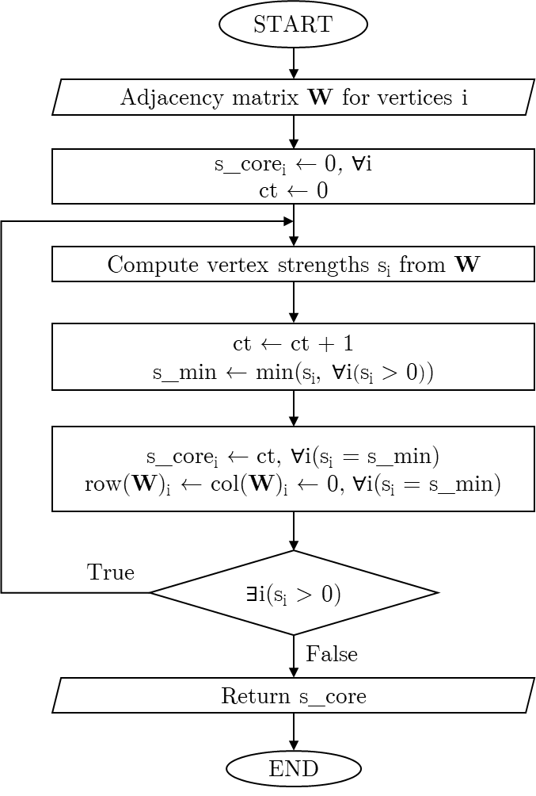
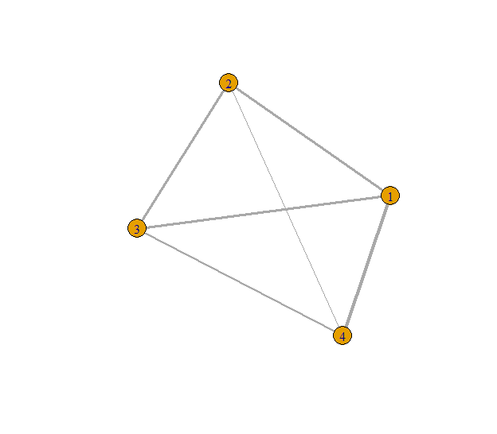
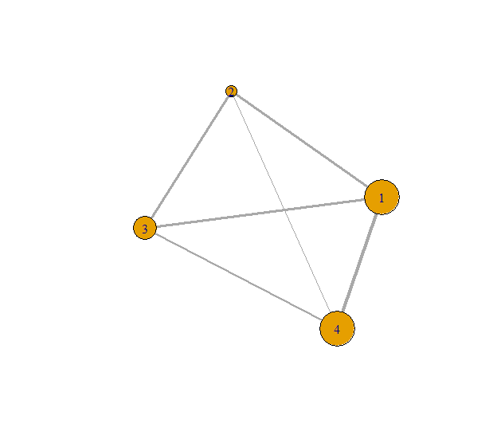
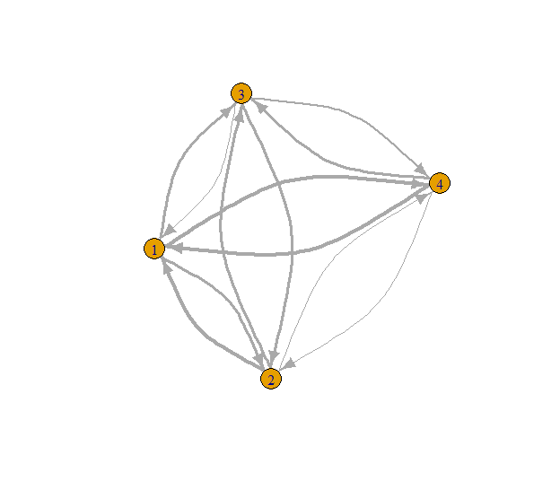
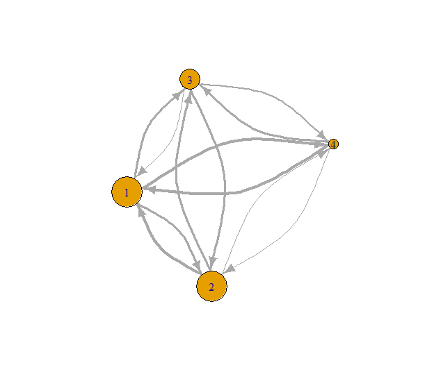
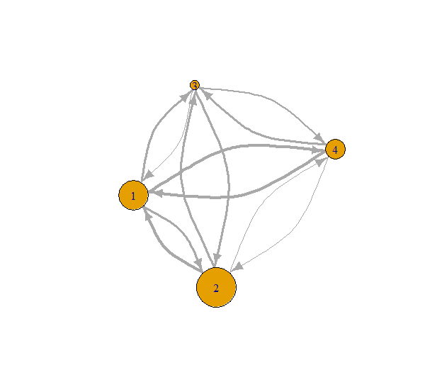

<!-- badges: start -->
[](https://CRAN.R-project.org/package=scoredec)
[](https://github.com/cadam00/scoredec/actions/workflows/R-CMD-check.yaml)
  [](https://app.codecov.io/gh/cadam00/scoredec?branch=main)
<!-- badges: end -->
  
# **Installation**

You can install the development version of **scoredec** like so:

``` r
if (!require(remotes)) install.packages("remotes")
remotes::install_github("cadam00/scoredec")
```

# **s-core algorithm**

s-core algorithm ([Eidsaa and Almaas, 2013](#ref-eidsaa2013s)) is a variation of
the traditional k-core algorithm. In particular, it is used for decomposing
graph using the connections of the vertices. However, s-core is not restricted
to only binary adjacency matrix like k-core algorithm (connected/not connected),
but connectivity weights are utilized. A clear R implementation of the algorithm
is done on **brainGraph** R package ([Watson, 2024](#ref-brainGraph)).

An expression of the flow chart for this s-core algorithm is shown on Fig.
<a href="#ref-Figure1">1</a>. Note that the implementation of the **scoredec**
package is has some minor but significant differences, allowing it to be much
more time and memory efficient.

<p align="center">
  
</p>
<p class="caption" align="center">
<span id="ref-Figure1"></span>Fig. 1: s-core algorithm flowchart
</p>

# **Example applications**

## **Example undirected graph**

```r
# Import libraries
library(scoredec)
library(igraph)

# Create a dummy undirected graph
set.seed(42)
n <- 4
W <- matrix(runif(n^2),n)
W[lower.tri(W)] <- t(W)[lower.tri(W)]
diag(W) <- 0

# Print adjacency matrix
print(W)
```

```
##           [,1]      [,2]      [,3]      [,4]
## [1,] 0.0000000 0.6417455 0.6569923 0.9346722
## [2,] 0.6417455 0.0000000 0.7050648 0.2554288
## [3,] 0.6569923 0.7050648 0.0000000 0.4622928
## [4,] 0.9346722 0.2554288 0.4622928 0.0000000

```

```r
# Transform adjacency matrix to graph
g <- graph_from_adjacency_matrix(W, mode = "undirected", weighted = TRUE)

# Set seed for reproducible plot
set.seed(42)
plot(g,
     edge.width=E(g)$weight * 5 # make connection weight lines thicker
     )
```

<p align="center">
  
</p>
<p class="caption" align="center">
<span id="ref-Figure2"></span>Fig. 2: Example undirected graph with connectivity
lines sized by their weights.
</p>

It is clear on Fig. <a href="#ref-Figure2">2</a> that some connections are
stronger than others, having greater connectivity weights. Moreover, the same
vertex might has some strong and some weak weights. Therefore, decomposing the
graph visually might get hard, especially on larger networks.

```r
# Get s-core values
s_core_result <- s_coreness(g)
print(s_core_result)
```
```
## [1] 3 1 2 3
```

```r
# Plot result from s_coreness
# Set seed for reproducibility
set.seed(42)

plot(g,
     edge.width  = E(g)$weight * 5, # make connection weight lines thicker
     vertex.size = s_core_result * 10
     )
```
<p align="center">
  
</p>
<p class="caption" align="center">
<span id="ref-Figure3"></span>Fig. 3: Example undirected graph with vertices
sized by their s-coreness
</p>

It is shown on Fig. <a href="#ref-Figure3">3</a> that vertices 1 and 4 have
higher coreness compared to all the other vertices, while vertex 2 has the
smallest one. Note that for undirected graphs the mode (`"all"`,`"in"` or
`"out"`) does not matter:
```r
all.equal(s_core_result, s_coreness(g, mode = "in"))
```
```
## [1] TRUE
```

```r
all.equal(s_core_result, s_coreness(g, mode = "out"))
```
```
## [1] TRUE
```

Therefore, for efficiency reasons, choosing `mode = "in"` or `mode = "out"` is
preferred, as long as the sum of adjacency matrix with its transpose for
transforming it to undirected is not needed.

## **Example directed graph**

```r
# Create a dummy directed graph
set.seed(42)
n <- 4
W <- matrix(runif(n^2),n)
diag(W) <- 0

# Print adjacency matrix
print(W)
```

```
##           [,1]      [,2]      [,3]      [,4]
## [1,] 0.0000000 0.6417455 0.6569923 0.9346722
## [2,] 0.9370754 0.0000000 0.7050648 0.2554288
## [3,] 0.2861395 0.7365883 0.0000000 0.4622928
## [4,] 0.8304476 0.1346666 0.7191123 0.0000000

```

```r
# Transform adjacency matrix to graph
g <- graph_from_adjacency_matrix(W, mode = "directed", weighted = TRUE)

# Set seed for reproducible plot
set.seed(42)
plot(g,
     edge.width=E(g)$weight * 5, # make connection weight lines thicker,
     edge.curved = rep(0.4, ecount(g)) # make directions more visible
     )
```
<p align="center">
  
</p>
<p class="caption" align="center">
<span id="ref-Figure4"></span>Fig. 4: Example directed graph with connectivity
lines per direction sized by their weights.
</p>

As show on Fig. <a href="#ref-Figure4">4</a>, finding coreness with both
directions and weights is even harder. Therefore, the use of s-core algorithm is
even more cruicial here. In correspondence to the use of in-degree and
out-degree strength of vertices used on k-cores
([Csárdi and Nepusz 2006](#ref-csardi2006igraph);
[Csárdi et al. 2024](#ref-igraph)), this algorithm is extended in the same way
as well.

```r
# Get total degree s-core values
all_s_core <- s_coreness(g, mode = "all")
print(all_s_core)
```
```
## [1] 3 3 2 1
```

```r
# Set seed for reproducibility
set.seed(42)

plot(g,
     edge.width  = E(g)$weight * 5, # make connection weight lines thicker,
     edge.curved = rep(0.4, ecount(g)), # make directions more visible
     vertex.size = all_s_core * 10
     )
```

<p align="center">
  
</p>
<p class="caption" align="center">
<span id="ref-Figure5"></span>Fig. 5: Total degree s-coreness.
</p>

```r
# Get in-degree s-core values
in_s_core <- s_coreness(g, mode = "in")
print(in_s_core)
```
```
## [1] 2 1 4 3
```

```r
# Set seed for reproducibility
set.seed(42)

plot(g,
     edge.width  = E(g)$weight * 5, # make connection weight lines thicker,
     edge.curved = rep(0.4, ecount(g)), # make directions more visible
     vertex.size = in_s_core * 10
     )
```
<p align="center">
  
</p>
<p class="caption" align="center">
<span id="ref-Figure6"></span>Fig. 6: In-degree s-coreness.
</p>


```r
# Get out-degree s-core values
out_s_core <- s_coreness(g, mode = "out")
print(out_s_core)
```
```
## [1] 3 4 1 2
```

```r
# Plot result from s_coreness
# Set seed for reproducibility
set.seed(42)

plot(g,
     edge.width  = E(g)$weight * 5, # make connection weight lines thicker,
     edge.curved = rep(0.4, ecount(g)), # make directions more visible
     vertex.size = out_s_core * 10
     )
```
<p align="center">
  
</p>
<p class="caption" align="center">
<span id="ref-Figure7"></span>Fig. 7: Out-degree s-coreness.
</p>


# **References**

Csárdi, Gábor, and Tamás Nepusz. (2006)
“<span class="nocase" id="ref-csardi2006igraph">The igraph
software package for complex network research</span>.” *InterJournal*
Complex Systems: 1695. [https://igraph.org](https://igraph.org).

Csárdi, Gábor, Tamás Nepusz, Vincent Traag, Szabolcs Horvát, Fabio
Zanini, Daniel Noom, and Kirill Müller. (2024)
“<span class="nocase" id="ref-igraph">
igraph: Network Analysis and Visualization in
R</span>”. [https://doi.org/10.5281/zenodo.7682609](https://doi.org/10.5281/zenodo.7682609).

Eidsaa, M. and Almaas, E. (2013) *<span class="nocase" id="ref-eidsaa2013s">
“s-core network decomposition: A generalization of k-core analysis to weighted
networks”</span>*, <em>Phys. Rev. E.</em>, American Physical Society, <b>88</b>,
062819.
[https://doi.org/10.1103/PhysRevE.88.062819](https://doi.org/10.1103/PhysRevE.88.062819).

Watson, C.G. (2024). <span class="nocase" id="ref-brainGraph">“brainGraph: Graph
Theory Analysis of Brain MRI Data</span>”. R package version 3.1.0.
[https://doi.org/10.32614/CRAN.package.brainGraph](https://doi.org/10.32614/CRAN.package.brainGraph).
