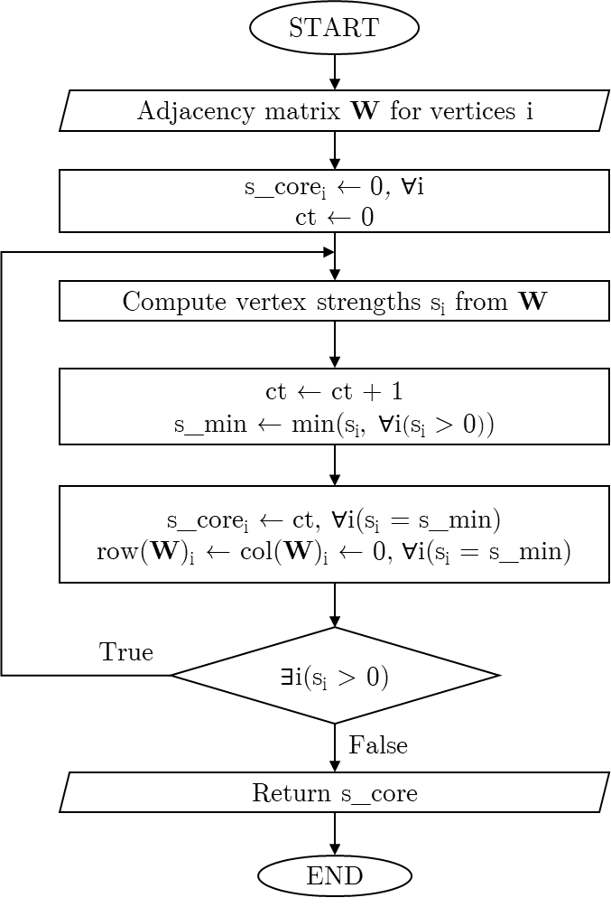

```{r setup, include=FALSE}
knitr::opts_chunk$set(echo = TRUE, eval=FALSE)
```

# **s-core algorithm**

s-core algorithm ([Eidsaa and Almaas, 2013](#ref-eidsaa2013s)) is a variation of
the traditional s-core algorithm. In particular, it is used for decomposing
graph using the connections of the vertices. However, s-core is not restricted
to only binary adjacency matrix like k-core algorithm (connected/not connected),
but connectivity weights are utilized. A clear R implementation of the algorithm
is done on **brainGraph** R package
([Watson, 2024](#ref-brainGraph))

An expression of the flow chart for this s-core the algorithm is shown on Fig.
<a href="#ref-Figure1">1</a>. Note that the implementation of the **scoredec**
package is has some minor but significant differences, allowing it to be much
more time and memory efficient.

```{r Figure1, eval=TRUE, echo=FALSE, out.width = '70%', fig.align = "center"}

```
<p class="caption" align="center">
<span id="ref-Figure1"></span>Fig. 1: s-core algorithm flowchart
</p>

# **Example application**

```r
# Import libraries
library(scoredec)
library(igraph)

# Create a dummy undirected graph
set.seed(42)
n <- 4
W <- matrix(runif(n^2),n)
W[lower.tri(W)] <- t(W)[lower.tri(W)]
diag(W) <- 0
g <- graph_from_adjacency_matrix(W, mode = "undirected", weighted = TRUE)

# Set seed for reproducibility
set.seed(42)
plot(g,
     edge.width = E(g)$weight * 5 ## make connection weight lines thicker
     )
```

```{r Figure2, eval=TRUE, echo=FALSE, out.width = '70%', fig.align = "center"}
knitr::include_graphics("fig2.png")
```
<p class="caption" align="center">
<span id="ref-Figure2"></span>Fig. 2: Example graph with connectivity lines
sized by their weights.
</p>

It is clear on Fig. <a href="#ref-Figure2">2</a> that some connections are
stronger than others, having greater connectivity weights. Moreover, the same
vertex might has some strong and some weak weights. Therefore, decomposing the
graph visually might get hard, especially on larger networks.

```r
# Get s-core values
s_core_result <- s_coreness(g)
print(s_core_result)
## [1] 3 1 2 3
```

```r
# Set seed for reproducibility
set.seed(42)

plot(g,
     edge.width  = E(g)$weight * 5, ## make connection weight lines thicker
     vertex.size = s_core_result * 10
     )
```
```{r Figure3, eval=TRUE, echo=FALSE, out.width = '70%', fig.align = "center"}
knitr::include_graphics("fig3.png")
```
<p class="caption" align="center">
<span id="ref-Figure3"></span>Fig. 3: Example graph with vertices sized by their
s-coreness
</p>

It is shown on Fig. <a href="#ref-Figure3">3</a> that vertices 1 and 4 have
higher coreness compared to all the other vertices, while vertex 2 has the
smallest one.

## **References**
Eidsaa, M. and Almaas, E. (2013) ‘<span class="nocase" id="ref-eidsaa2013s">
s-core network decomposition: A generalization of k-core analysis to weighted
networks</span>’, <em>Phys. Rev. E.</em>, American Physical Society, <b>88</b>, 062819.
[https://doi.org/10.1103/PhysRevE.88.062819](https://doi.org/10.1103/PhysRevE.88.062819).

Watson, C.G. (2024). *<span class="nocase" id="ref-brainGraph">brainGraph: Graph
Theory Analysis of Brain MRI Data</span>*. R package version 3.1.0.
[https://doi.org/10.32614/CRAN.package.brainGraph](https://doi.org/10.32614/CRAN.package.brainGraph).
